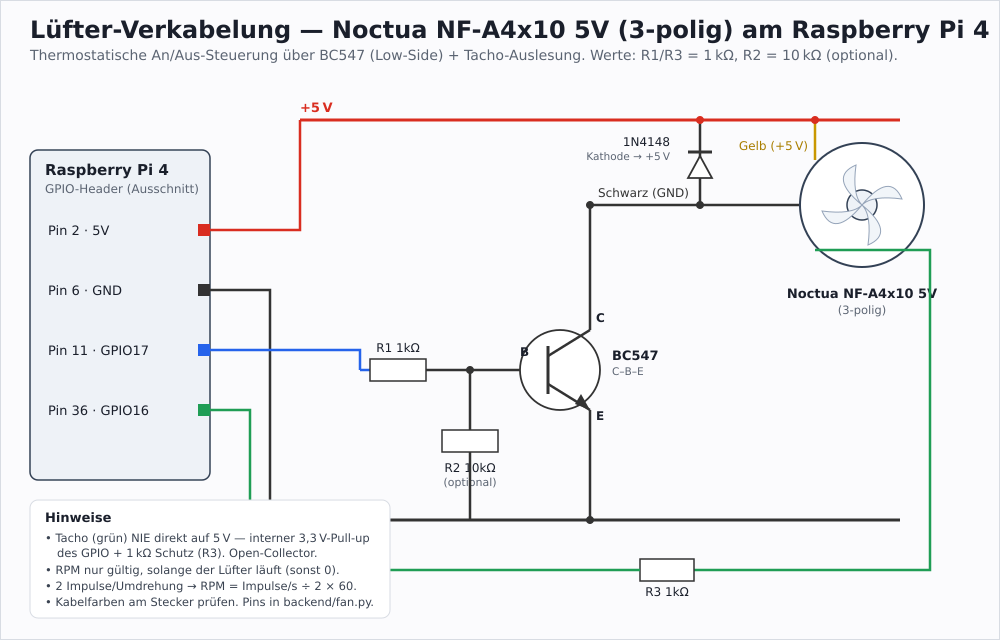

# Drone Streamer Portal

Low-latency FPV video portal for a Raspberry Pi: capture a camera/HDMI feed,
stream it to the browser over WebRTC, and watch it full-screen — including a
split-screen **VR mode** for phone-in-headset viewing.

---

## 1. Purpose & technologies

The portal turns a Raspberry Pi with a USB/CSI capture device into a self-contained
FPV streaming appliance. You open its web page on a phone or laptop in the same
network and get a near-real-time view of the camera, with a one-tap VR (dual-eye)
mode and an installable PWA so it can run full-screen without browser chrome.

A settings page lets you change the capture device, resolution, framerate and
bitrate live, and a hardware page shows CPU/GPU temperature and load.

**Stack**

| Layer | Technology |
| --- | --- |
| Capture & streaming | [MediaMTX](https://github.com/bluenviron/mediamtx) (WebRTC / WHEP) fed by an `ffmpeg` V4L2 pipeline; `h264_v4l2m2m` hardware encoder on the Pi |
| Frontend | Vue 3 + Vite + TypeScript, [Nuxt UI](https://ui.nuxt.com) 4, Tailwind 4; a canvas-based WebRTC renderer with normal + VR (split-screen) modes; installable PWA |
| Backend | Python [FastAPI](https://fastapi.tiangolo.com) (uvicorn) — stream settings (edits `mediamtx.yml`) and hardware monitoring over WebSocket |
| Web server | nginx (serves the built frontend, proxies WHEP/HLS to MediaMTX) |
| Packaging & delivery | Debian `.deb` built in CI, published to a signed **apt repository on GitHub Pages**; `systemd` units + a stream watchdog |

The whole appliance ships as **one Debian package** (frontend, backend, MediaMTX
binary, nginx site, systemd units). A user-edited `mediamtx.yml` is preserved
across updates.

---

## 2. Installation (Raspberry Pi)

Requires a 64-bit Raspberry Pi OS (arm64). `apt` pulls in the system
dependencies (nginx, ffmpeg, v4l-utils, python3-venv) automatically.

### Recommended — apt repository

Registers the signed apt repo, so **future updates are just
`sudo apt update && sudo apt upgrade`**:

```bash
curl -fsSL https://raw.githubusercontent.com/likt0r/drone-streamer-portal/main/scripts/install-pi.sh | sudo bash
```

This adds the signing key to `/usr/share/keyrings/`, writes
`/etc/apt/sources.list.d/drone-streamer-portal.list`, and installs the package.

### Offline / manual

Grab the `drone-streamer-portal_<version>_arm64.deb` asset from the
[latest release](https://github.com/likt0r/drone-streamer-portal/releases/latest)
and install it directly (works without the apt repo):

```bash
sudo apt install ./drone-streamer-portal_<version>_arm64.deb
# or, from a repo checkout:
sudo bash scripts/install-pi.sh path/to/drone-streamer-portal_<version>_arm64.deb
```

### After installing

The portal is reachable at `http://<pi-ip>/`. Useful checks:

```bash
sudo systemctl status mediamtx drone-stats nginx
sudo systemctl status mediamtx-watchdog.timer
```

On a phone, open the page and use **Add to Home Screen** to install the PWA —
VR mode then runs full-screen without browser chrome.

---

## 3. Dev setup

You can run and develop the whole portal on a normal Linux laptop, without a Pi.

### 3.1 Prerequisites

```bash
# Debian/Ubuntu
sudo apt update && sudo apt install -y v4l-utils ffmpeg
# Fedora
sudo dnf install -y v4l-utils ffmpeg
```

[Bun](https://bun.sh) is used for the frontend; Python 3 for the backend.

### 3.2 A video source for MediaMTX

The frontend talks to MediaMTX over WebRTC at an `fpv` path. In dev, the Vite
dev server proxies `/{stream}/whep` to a local MediaMTX on `:8889`
(see `vite.config.ts`), so you just need MediaMTX serving an `fpv` stream.

**Option A — a dummy test pattern (no camera needed):**

```bash
# MediaMTX with host networking (WebRTC :8889, RTSP :8554)
docker run -d --name mediamtx-dev --network=host bluenviron/mediamtx

# Publish a 1280x720 test pattern as the "fpv" stream
ffmpeg -re -f lavfi -i "testsrc2=size=1280x720:rate=30" \
  -c:v libx264 -preset ultrafast -tune zerolatency -profile:v baseline \
  -pix_fmt yuv420p -b:v 2M -g 60 -an \
  -f rtsp -rtsp_transport tcp rtsp://localhost:8554/fpv
```

**Option B — your webcam.** Download MediaMTX from
[GitHub](https://github.com/bluenviron/mediamtx/releases), then add an `fpv`
path pointing at your camera (find it with `v4l2-ctl --list-devices`, usually
`/dev/video0`):

```yaml
paths:
  fpv:
    source: v4l2
    v4l2Device: /dev/video0
webrtc: yes
webrtcAddress: :8889
```

Run `./mediamtx`.

### 3.3 Frontend

```bash
bun install
bun run dev
```

Open `http://localhost:5173` and click **Start Streaming** (or **Start VR Mode**).
The app connects to MediaMTX through the Vite WHEP proxy and renders the feed.

### 3.4 Backend (stream settings / hardware monitoring)

```bash
cd backend
python3 -m venv venv && source venv/bin/activate
pip install -r requirements.txt
uvicorn main:app --host 0.0.0.0 --port 5002 --reload
```

The `/api/stream-settings` and hardware-monitoring WebSocket endpoints are then
available to the frontend.

### 3.5 Dev mode on a deployed Pi

On a Pi that already has the portal installed you can switch the live site
between the production build and a hot-reloading dev environment with one script
(both use port 80 + `:5002`, so they are mutually exclusive; the choice persists
across reboots):

```bash
# run as your normal user, NOT root:
scripts/dev-mode.sh dev      # nginx → Vite dev server (HMR); backend = uvicorn --reload from ./backend
scripts/dev-mode.sh prod     # nginx serves dist/; backend = drone-stats
scripts/dev-mode.sh status
```

In **dev** mode the Vite dev server runs as the `drone-dev-web` systemd service
and the backend as `drone-dev-api` (`uvicorn --reload`); the MediaMTX streaming
routes are identical to prod, so the live stream keeps working.

### 3.6 Cutting a release

Releases are automated with [release-it](https://github.com/release-it/release-it):

```bash
npm run release      # pick patch/minor/major
```

This bumps the version, commits, tags `vX.Y.Z` and pushes. The
[Release workflow](.github/workflows/release.yml) then builds the `.deb`,
publishes the GitHub release and updates the signed apt repository. The one-time
signing-key / GitHub Pages setup is documented in
[`apt-repo/README.md`](apt-repo/README.md).

---

## 4. Fan control (optional hardware add-on)

The Hardware Monitoring page can drive and monitor a small **case fan** wired to
the Pi's GPIO. This is optional — with no fan wired up, everything degrades
gracefully (the backend reports `fan_rpm = null` and the control is inactive).

Reference build: a **3-pin Noctua NF-A4x10 5V** on a **Raspberry Pi 4**. A 3-pin
fan has no PWM control wire, so speed is not steplessly adjustable — Noctua
advises against PWM-ing the supply of a non-PWM fan (it also corrupts the tacho
signal). Control is therefore a **thermostatic on/off switch with hysteresis**
(same idea as the kernel `gpio-fan` overlay); the **RPM readout** works whenever
the fan is powered. For stepless control, use the 4-pin *NF-A4x10 5V **PWM***
variant instead.

### Extra parts
A GPIO can't drive the fan's ~50 mA directly (≈16 mA max), so a small low-side
switch is needed:

- 1× NPN transistor **`BC547`** (or `BC337` for more headroom)
- 1× flyback diode **`1N4148`** (the fan is an inductive load)
- 1× **1 kΩ** base resistor, optionally 1× **10 kΩ** base pull-down
- 1× **1 kΩ** series resistor in the tacho line

### Wiring (BCM numbering)



Noctua 3-pin colours: **Yellow = +5 V**, **Black = GND**, **Green = tacho**
*(verify at your connector)*. BC547 pinout (TO-92, flat side toward you, legs
down): left→right = **C – B – E**.

| Connection | From | To |
| --- | --- | --- |
| Supply | fan **Yellow** | Pi **5V** (pin 2 or 4) |
| Fan ground (switched) | fan **Black** | BC547 **collector** |
| Ground | BC547 **emitter** | Pi **GND** (pin 6) |
| Control | Pi **GPIO17** (pin 11) → 1 kΩ | BC547 **base** |
| Base pull-down (optional) | BC547 **base** → 10 kΩ | GND |
| Flyback diode `1N4148` | anode = collector (fan black), cathode = +5 V | across the fan |
| Tacho / RPM | fan **Green** → 1 kΩ | Pi **GPIO16** (pin 36) |

**Safety notes**

- **Never tie the tacho (green) straight to 5 V.** It's open-collector; run it on
  the GPIO's internal **3.3 V pull-up**. The 1 kΩ series resistor protects the
  GPIO if the fan's ground floats up while the fan is off (low-side switching).
- The tacho only reads valid RPM **while the fan is running** (0 when off).
- 2 tacho pulses per revolution → `RPM = pulses_per_second / 2 × 60`.
- Pin GPIO17/GPIO16 are configurable in `backend/fan.py`.

### Using it
Open **Settings → Hardware Monitoring**. The **Fan** badge and *Fan Speed History*
chart show live RPM. The **Fan Control** card switches between:

- **Automatisch** — on above / off below the CPU-temperature thresholds you set
  (defaults 60 °C on, 50 °C off).
- **Manuell** — force the fan on or off.

Settings are served by `GET/POST /api/fan-settings` and persisted in
`backend/fan_settings.json`. GPIO access uses `gpiozero`/`lgpio` (pulled in by
the backend `requirements.txt`); the backend already runs as root, so no extra
overlay or reboot is required.
